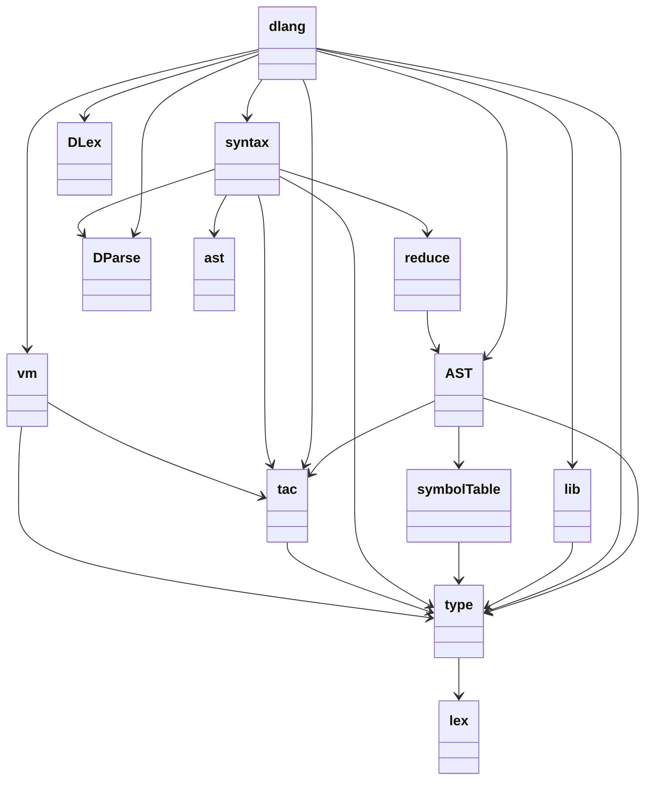

# DLang
模块概览：




AST类图:

```mermaid
classDiagram
	class BasicASTNode{
		type : ASTNodeType
		visit()
	}
	BasicASTNode <|-- RootASTNode
	class RootASTNode{
		fns : list[FunctionASTNode]
		main : FunctionASTNode
		merge()
		visit()
	}
	RootASTNode --> FunctionASTNode
	
    BasicASTNode <|-- FunctionASTNode
	class FunctionASTNode{
        name: string;
        returnType: ValueType | VoidType;
        haveReturn: boolean;
        args: ArgDefineListASTNode;
        statements: StatementASTNode[]
        getArgsType()
        visit(context: Context): NodeVisitorReturn
	}
	
	FunctionASTNode --> StatementASTNode
	StatementListASTNode --> StatementASTNode
	
	BasicASTNode <|-- StatementListASTNode
	class StatementListASTNode{
        statements: StatementASTNode[] = [];
        createContext: boolean;
        haveReturn: boolean = false;
        merge(other: StatementListASTNode)
        visit(context: Context): NodeVisitorReturn
	}
	BasicASTNode <|-- IfStatementASTNode
	class IfStatementASTNode{
        condition: ValueASTNode;
        body: StatementASTNode;
        elseBody?: StatementASTNode;
        haveReturn()
        visit(context: Context): NodeVisitorReturn
	}
	IfStatementASTNode --> ValueASTNode
	IfStatementASTNode --> StatementASTNode
	IfStatementASTNode --> NodeVisitorReturn
	BasicASTNode <|-- WhileStatementASTNode
	
	class WhileStatementASTNode{
        condition: ValueASTNode;
        body: StatementASTNode;
        visit(context: Context): NodeVisitorReturn
	}
	WhileStatementASTNode --> ValueASTNode
	WhileStatementASTNode --> StatementASTNode
	WhileStatementASTNode --> NodeVisitorReturn
	
	BasicASTNode <|-- ForStatementASTNode
	class ForStatementASTNode{
        init: DefineListASTNode | UnitOPASTNode[];
        condition: ValueASTNode;
        update: UnitOPASTNode[];
        body: StatementASTNode;
        visit(context: Context): NodeVisitorReturn 
	}
	ForStatementASTNode --> DefineListASTNode
	ForStatementASTNode --> UnitOPASTNode
	ForStatementASTNode --> ValueASTNode
	ForStatementASTNode --> StatementASTNode
	ForStatementASTNode --> NodeVisitorReturn
	
	BasicASTNode  <|-- DefineListASTNode
	class DefineListASTNode{
        defs: DefineASTNode[] = [];
        isConst: boolean = false;
        merge(other: DefineListASTNode)
        visit(context: Context): NodeVisitorReturn
	}
	DefineListASTNode --> DefineASTNode
	DefineListASTNode --> NodeVisitorReturn
	BasicASTNode  <|-- DefineASTNode
	class DefineASTNode{
        dst: Variable;
        src?: ValueASTNode;
        visit(context: Context): NodeVisitorReturn
	}
	DefineListASTNode --> NodeVisitorReturn
	DefineListASTNode --> Variable
	DefineListASTNode --> ValueASTNode
	
	BasicASTNode <|-- ArgDefineListASTNode
	class ArgDefineListASTNode{
    	defs: Variable[] = [];
        merge(other: ArgDefineListASTNode)
        visit(context: Context): NodeVisitorReturn
	}
	ArgDefineListASTNode --> Variable
	ArgDefineListASTNode --> ArgDefineListASTNode
	ArgDefineListASTNode --> NodeVisitorReturn
	BasicASTNode <|-- LeafASTNode
	class LeafASTNode{
		dst: Variable | Literal;
		visit(context: Context): NodeVisitorReturn
	}
	LeafASTNode --> NodeVisitorReturn
	LeafASTNode --> Variable
	LeafASTNode --> Literal
	
	BasicASTNode <|-- BinOPASTNode
	class BinOPASTNode{
        dst: Variable;
        x: ValueASTNode;
        y: ValueASTNode;
        visit(context: Context): NodeVisitorReturn
	}
	BinOPASTNode --> ValueASTNode
	BinOPASTNode --> Variable
	BinOPASTNode --> NodeVisitorReturn
	
	BasicASTNode <|-- UnitOPASTNode
	class UnitOPASTNode{
        dst: Variable;
        src: ValueASTNode;
        visit(context: Context): NodeVisitorReturn
	}
	UnitOPASTNode --> NodeVisitorReturn
	UnitOPASTNode --> ValueASTNode
	UnitOPASTNode --> Variable
	
	BasicASTNode <|-- FunctionCallASTNode
	class FunctionCallASTNode{
        name: string;
        args: FunctionCallArgListASTNode;
        visit(context: Context): NodeVisitorReturn
	}
	FunctionCallASTNode --> NodeVisitorReturn
	FunctionCallASTNode --> FunctionCallArgListASTNode
	
	BasicASTNode <|-- FunctionCallArgListASTNode
	class FunctionCallArgListASTNode{
        args: ValueASTNode[] = [];
        types: ValueType[] = [];
        merge(other: FunctionCallArgListASTNode)
        length()
        checkType(realArgs: ValueType[])
        visit(context: Context): NodeVisitorReturn
	}
	FunctionCallArgListASTNode --> ValueASTNode
	FunctionCallArgListASTNode --> NodeVisitorReturn
	BasicASTNode <|-- FunctionReturnASTNode
	class FunctionReturnASTNode{
		src?: ValueASTNode;
		visit(context: Context): NodeVisitorReturn
	}
	FunctionReturnASTNode --> FunctionReturnCode

```



#### 输出“你好 世界！”

打开一门语言的仪式感

```
函 主() {
  出("你好 世界!");
}
```

**执行情况**

```powershell
> python .\cli.py .\test\helloWorld-zh.dl
你好 世界!
```


#### 输出长度为n的斐波那契数列

测试函数调用、遍历、库函数

```
函 主(甲: 整) {
  若 (甲 < 1) {
    出("长度不可以小于1");
    得 ;
  }
  组::创("杨辉");
  组::赋("杨辉", 甲 + 5);
  组::置("杨辉", 1, 1);
  组::置("杨辉", 2, 1);
  遍 (令 子 = 3; 子 <= 甲; 子 = 子 + 1) {
    组::置("杨辉", 子, 组::拿("杨辉", 子 - 1) + 组::拿("杨辉", 子 - 2));
  }
  遍 (令 子 = 1; 子 <= 甲; 子 = 子 + 1) {
    出(整型::变串(组::拿("杨辉", 子)));
  }
}
```

**执行情况**

```powershell
> python .\cli.py .\test\array-zh.dl -a 5
1
1
2
3
5
```


#### 复数以及浮点数的运算

测试复数、浮点数运算

```
函 主() {
    令 甲 = 1+2i;
    令 乙 = 2+1i;
    出(复型::变串(甲 + 乙));
    出(复型::变串(甲 * 乙));
    令 丙 = 1.5e5;
    令 丁 = 1.2E2;
    出(浮型::变串(丙 + 丁));
}
```

**执行情况**

```powershell
> python .\cli.py .\test\complex-zh.dl
(3+3j)
5j
150120.0
```


#### 输出第n个斐波那契数

测试函数栈（递归情况）

```
函 杨辉(甲: 整) -> 整 {
  若 (甲 <= 2) {
    得 1;
  } 否则 {
    得 杨辉(甲 - 1) + 杨辉(甲 - 2);
  }
}

函 主() {
  出(整型::变串(杨辉(5)));
}
```

**执行情况**

```powershell
> python .\cli.py .\test\fib-zh.dl
5
```


#### 输入n个数，计算其总和

测试输入功能

```
函 主() {
    令 总数 = 入::下一个整();
    令 总和 = 0;
    遍 (令 子 = 1; 子 <= 总数; 子 = 子 + 1) {
        令 甲 = 入::下一个整();
        出(整型::变串(甲));
        总和 = 总和 + 甲;
    }
    出(整型::变串(总和));
}
```

输入文件的数据

```
5
1 2 4 5 7
```

**执行情况**

```powershell
> python .\cli.py .\test\input-getsum-zh.dl -i .\test\input-data
1
2
4
5
7
19
```


# 


