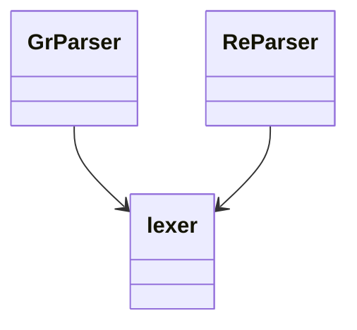
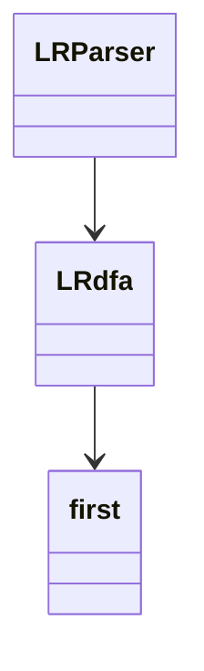
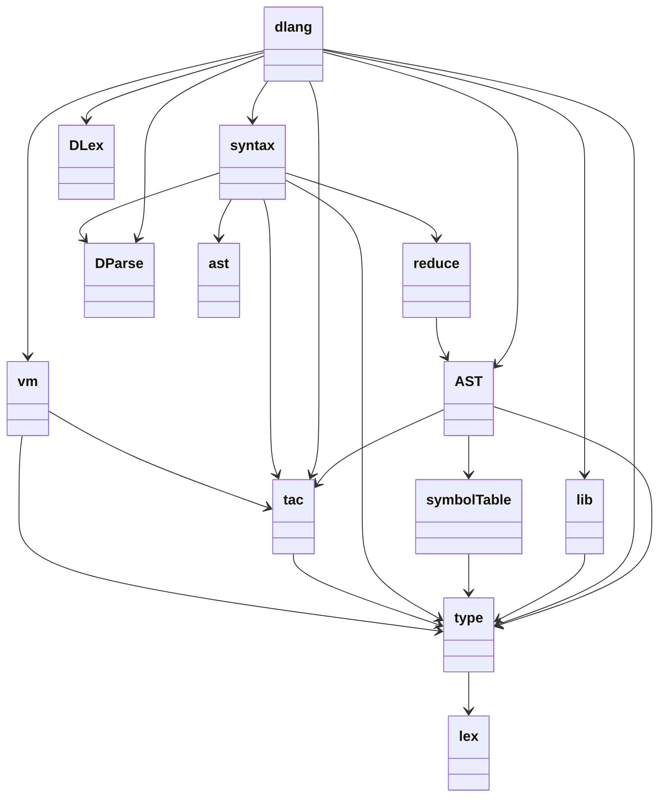

# 词法分析

项目仓库：[DLex](https://github.com/dailing57/DLex)

本次课程设计的词法分析器（以下简称DLex），可以使用正规文法和正则表达式两种格式进行分析。由NFA到DFA的过程，默认对DFA进行最小化。

## 设计思路

可以把DLex的核心分成两部分：根据输入规则生成自动机，根据输入代码在自动机上行走来获取token流。

本次课程设计要求使用三型文法来生成DFA，在实现之后（GrParser——grammar parser），实际的规则非常冗长。特别是比如某条文法需要整个字符集的时候，会让整个规则文件非常臃肿（见rule.txt），如果字符集为汉字的话更是不堪设想。所以之后又追加实现了支持正则式的分析器（ReParser——regex parser）。

lexer实现了NFA到DFA的转化、DFA最小化。

GrParser实现利用正则表达式以及表达式相印值计算的规则生成NFA，之后调用lexer的确定化和最小化获得DFA，最后实现自动机上行走来获取token流。

GrParser实现利用三型文法生成NFA，之后调用lexer的确定化和最小化获得DFA，最后实现自动机上行走来获取token流。



## 部分细节

### 三型文法转NFA

这个操作非常简单，只需要根据输入文件，左右两个非终结符之间连一条权为终结符的边即可。

### 正规式转NFA

参考[ruslanspivak实现一个简易计算器的操作](https://ruslanspivak.com/lsbasi-part3/)，递归地求解正规式，设置函数：`range` 、`factor`、 `term` 、`termList`、 `expr`

详细实现见代码说明文档。

### 确定化

采用子集法，在代码实现中需要将集合作为键，可以使用python中的frozenset。

### 最小化

采用Hopcroft算法

## 使用示例

### 正规文法

#### DFA画图

##### 执行语句

```powershell
python .\cli.py -g .\test\rule.txt -d
```

##### 运行结果

[](https://imgtu.com/i/bvJmlj)

#### 分析代码获取token流

##### 执行语句

```powershell
python .\cli.py -g .\test\rule.txt -p -codefile .\test\codeGr
```

`.\test\codeGr`中的内容：

```
import A
int main(){
    string s = "helloWorld";
    return 0;
}
```

##### 运行结果

```
row:1,col:0,value:import
row:1,col:6,value:A
row:2,col:0,value:int
row:2,col:3,value:main
row:2,col:8,value:(
row:2,col:9,value:)
row:2,col:10,value:{
row:3,col:4,value:string
row:3,col:10,value:s
row:3,col:12,value:=
row:3,col:14,value:"helloWorld"
row:3,col:27,value:;
row:4,col:4,value:return
row:4,col:10,value:0
row:4,col:12,value:;
row:5,col:0,value:}
```

#### 对DFA进行持久化

##### 执行语句

```powershell
python .\cli.py -g .\test\rule.txt -pk
```

##### 运行结果

获得一个名为`DFAresult`的pickle文件。

### 正则表达式

#### DFA画图

为了便于得到token的类型，对于正则表达式采用每一种模式分别生成一个DFA的办法，所以需要有选择的进行画图。

比如，查看一个类型为`COMPLEX`的DFA，则：

##### 执行语句

```powershell
python .\cli.py -r .\config.json -d -type 'COMPLEX'
```

##### 运行结果

[](https://imgtu.com/i/bvNY9S)

#### 分析代码获取token流

##### 执行语句

```powershell
python .\cli.py -r .\config.json -p -codefile .\test\codeRe
```

`.\test\codeRe`中的内容：

```
import A
int main(){
    string s = "I want to say :\"helloWorld\"";
    cp = 4+8i
    se = 5E+9
    int a=10
    return 0;
}
"""sdfas
```

##### 运行结果

```
LexerError: Lexer error on 's' line: 9 column: 8
Token(IMPORT, 'import', position=1:6)
Token(ID, 'A', position=1:8)
Token(INT, 'int', position=2:3)
Token(MAIN, 'main', position=2:8)
Token(LP, '(', position=2:9)
Token(RP, ')', position=2:10)
Token(CLP, '{', position=2:11)
Token(STRING, 'string', position=3:10)
Token(ID, 's', position=3:12)
Token(ASSIGN, '=', position=3:14)
Token(STRINGVALUE, '"I want to say :\\"helloWorld\\""', position=3:46)
Token(SEMI, ';', position=3:47)
Token(ID, 'cp', position=4:6)
Token(ASSIGN, '=', position=4:8)
Token(COMPLEX, '4+8i', position=4:13)
Token(ID, 'se', position=5:6)
Token(ASSIGN, '=', position=5:8)
Token(SCIENCE, '5E+9', position=5:13)
Token(INT, 'int', position=6:7)
Token(ID, 'a', position=6:9)
Token(ASSIGN, '=', position=6:10)
Token(INTEGER, '10', position=6:12)
Token(RETURN, 'return', position=7:10)
Token(INTEGER, '0', position=7:12)
Token(SEMI, ';', position=7:13)
Token(CRP, '}', position=8:1)
Token(STRINGVALUE, '""', position=9:2)
```

#### 对DFA进行持久化

##### 执行语句

```powershell
python .\cli.py -r .\config.json -pk
```

##### 运行结果

获得一个名为`DFAresult`的pickle文件。

# 语法分析、语义分析

项目仓库：[DParse](https://github.com/dailing57/DParse)

## 设计思路

语法分析器（以下简称DParse）采用LR(1)分析法，并且采用S属性文法，在进行语法分析的时候同时进行语义分析。DParse可以分为三个部分：first集计算（first），根据二型文法生成DFA（LRdfa），根据token流在Action-Goto表上行走获得结果。



## 部分细节

### 求项目集闭包

把当前项目集中的项目放入队列进行BFS。

### DFA构造

同样采用BFS。

### 根据DFA求Action-Goto表

遍历DFA即可。

如果action表中，如果某一个项目走到终点，如果发生冲突：

如果是状态转移则发生移进归约冲突

否则就是归约归约冲突

### 根据Token流在Action-Goto表模拟

此部分比较简单，直接模拟即可。

## 使用示例

由于DParser主要是为下一步中间代码生成做准备，并未提供cli接口，测试可以见`LRParser.test`

对于以下文法：

```
S -> CC 语义：返回左边C值加上右边C值
C -> cC 语义：返回1+C
C -> d 语义：返回0
c,d是终结符
S,C是非终结符
```

token流：

```
cccdcd // 结果是true 属性值4
c // 结果false
ddd // 结果是false
```

分别对应以下结果，第一部分是项目集族。

```
10
[frozenset({. d lookup=d   
, . c C lookup=c
, . c C lookup=d
, . C C lookup=__Dollar__  
, . S lookup=__Dollar__    
, . d lookup=c
}), frozenset({d . lookup=c
, d . lookup=d
}), frozenset({. d lookup=d
, . c C lookup=c
, . c C lookup=d
, c . C lookup=c
, c . C lookup=d
, . d lookup=c
}), frozenset({. d lookup=__Dollar__
, C . C lookup=__Dollar__
, . c C lookup=__Dollar__
}), frozenset({S . lookup=__Dollar__
}), frozenset({c C . lookup=c
, c C . lookup=d
}), frozenset({d . lookup=__Dollar__
}), frozenset({c . C lookup=__Dollar__
, . d lookup=__Dollar__
, . c C lookup=__Dollar__
}), frozenset({C C . lookup=__Dollar__
}), frozenset({c C . lookup=__Dollar__
})]
[None] [0] Token(c, 'c', position=0:1)
[None, Token(c, 'c', position=0:1)] [0, 2] Token(c, 'c', position=0:2)
[None, Token(c, 'c', position=0:1), Token(c, 'c', position=0:2)] [0, 2, 2] Token(c, 'c', position=0:3)
[None, Token(c, 'c', position=0:1), Token(c, 'c', position=0:2), Token(c, 'c', position=0:3)] 
[0, 2, 2, 2] Token(d, 'd', position=0:4)
[None, Token(c, 'c', position=0:1), Token(c, 'c', position=0:2), Token(c, 'c', position=0:3), 
Token(d, 'd', position=0:4)] [0, 2, 2, 2, 1] Token(c, 'c', position=0:5)
[None, Token(c, 'c', position=0:1), Token(c, 'c', position=0:2), Token(c, 'c', position=0:3), 
0] [0, 2, 2, 2, 5] Token(c, 'c', position=0:5)
[None, Token(c, 'c', position=0:1), Token(c, 'c', position=0:2), 1] [0, 2, 2, 5] Token(c, 'c', position=0:5)
[None, Token(c, 'c', position=0:1), 2] [0, 2, 5] Token(c, 'c', position=0:5)
[None, 3] [0, 3] Token(c, 'c', position=0:5)
[None, 3, Token(c, 'c', position=0:5)] [0, 3, 7] Token(d, 'd', position=0:6)
[None, 3, Token(c, 'c', position=0:5), Token(d, 'd', position=0:6)] [0, 3, 7, 6] Token(__Dollar__, '__Dollar__', position=-1:-1)
[None, 3, Token(c, 'c', position=0:5), 0] [0, 3, 7, 9] Token(__Dollar__, '__Dollar__', position=-1:-1)
[None, 3, 1] [0, 3, 8] Token(__Dollar__, '__Dollar__', position=-1:-1)
[None, 4] [0, 4] Token(__Dollar__, '__Dollar__', position=-1:-1)
(True, 4)
[None] [0] Token(c, 'c', position=0:1)
(False, Token(__Dollar__, '__Dollar__', position=-1:-1))
[None] [0] Token(d, 'd', position=0:1)
[None, Token(d, 'd', position=0:1)] [0, 1] Token(d, 'd', position=0:2)
[None, 0] [0, 3] Token(d, 'd', position=0:2)
(False, Token(d, 'd', position=0:3))
```

# 中间代码生成及执行

项目仓库：[DLang](https://github.com/dailing57/DLang)

## 设计思路

这一部分是整个项目难度最高，耗时最长的一部分，接下来将详细讲述其设计过程。

整体思路：利用之前的词法分析、语法分析、语义分析构建AST，通过DFS这棵AST来生成中间代码，然后实现一个虚拟机，通过虚拟机模拟执行生成的代码。

为了实现这样的操作，需要解决以下几个问题：

### 在哪里构建AST

由于是使用S属性文法，在语法分析时同时进行语义分析，那么构建AST实际上就是语义分析的工作。

那就需要在归约的时候把AST节点连接起来（见syntax与reduce）。

### AST包含哪些节点

在该项目中设置的节点类型以及它们之间的关系如下：

```mermaid
classDiagram
	class BasicASTNode{
		type : ASTNodeType
		visit()
	}
	BasicASTNode <|-- RootASTNode
	class RootASTNode{
		fns : list[FunctionASTNode]
		main : FunctionASTNode
		merge()
		visit()
	}
	RootASTNode --> FunctionASTNode
	
    BasicASTNode <|-- FunctionASTNode
	class FunctionASTNode{
        name: string;
        returnType: ValueType | VoidType;
        haveReturn: boolean;
        args: ArgDefineListASTNode;
        statements: StatementASTNode[]
        getArgsType()
        visit(context: Context): NodeVisitorReturn
	}
	
	FunctionASTNode --> StatementASTNode
	StatementListASTNode --> StatementASTNode
	
	BasicASTNode <|-- StatementListASTNode
	class StatementListASTNode{
        statements: StatementASTNode[] = [];
        createContext: boolean;
        haveReturn: boolean = false;
        merge(other: StatementListASTNode)
        visit(context: Context): NodeVisitorReturn
	}
	BasicASTNode <|-- IfStatementASTNode
	class IfStatementASTNode{
        condition: ValueASTNode;
        body: StatementASTNode;
        elseBody?: StatementASTNode;
        haveReturn()
        visit(context: Context): NodeVisitorReturn
	}
	IfStatementASTNode --> ValueASTNode
	IfStatementASTNode --> StatementASTNode
	IfStatementASTNode --> NodeVisitorReturn
	BasicASTNode <|-- WhileStatementASTNode
	
	class WhileStatementASTNode{
        condition: ValueASTNode;
        body: StatementASTNode;
        visit(context: Context): NodeVisitorReturn
	}
	WhileStatementASTNode --> ValueASTNode
	WhileStatementASTNode --> StatementASTNode
	WhileStatementASTNode --> NodeVisitorReturn
	
	BasicASTNode <|-- ForStatementASTNode
	class ForStatementASTNode{
        init: DefineListASTNode | UnitOPASTNode[];
        condition: ValueASTNode;
        update: UnitOPASTNode[];
        body: StatementASTNode;
        visit(context: Context): NodeVisitorReturn 
	}
	ForStatementASTNode --> DefineListASTNode
	ForStatementASTNode --> UnitOPASTNode
	ForStatementASTNode --> ValueASTNode
	ForStatementASTNode --> StatementASTNode
	ForStatementASTNode --> NodeVisitorReturn
	
	BasicASTNode  <|-- DefineListASTNode
	class DefineListASTNode{
        defs: DefineASTNode[] = [];
        isConst: boolean = false;
        merge(other: DefineListASTNode)
        visit(context: Context): NodeVisitorReturn
	}
	DefineListASTNode --> DefineASTNode
	DefineListASTNode --> NodeVisitorReturn
	BasicASTNode  <|-- DefineASTNode
	class DefineASTNode{
        dst: Variable;
        src?: ValueASTNode;
        visit(context: Context): NodeVisitorReturn
	}
	DefineListASTNode --> NodeVisitorReturn
	DefineListASTNode --> Variable
	DefineListASTNode --> ValueASTNode
	
	BasicASTNode <|-- ArgDefineListASTNode
	class ArgDefineListASTNode{
    	defs: Variable[] = [];
        merge(other: ArgDefineListASTNode)
        visit(context: Context): NodeVisitorReturn
	}
	ArgDefineListASTNode --> Variable
	ArgDefineListASTNode --> ArgDefineListASTNode
	ArgDefineListASTNode --> NodeVisitorReturn
	BasicASTNode <|-- LeafASTNode
	class LeafASTNode{
		dst: Variable | Literal;
		visit(context: Context): NodeVisitorReturn
	}
	LeafASTNode --> NodeVisitorReturn
	LeafASTNode --> Variable
	LeafASTNode --> Literal
	
	BasicASTNode <|-- BinOPASTNode
	class BinOPASTNode{
        dst: Variable;
        x: ValueASTNode;
        y: ValueASTNode;
        visit(context: Context): NodeVisitorReturn
	}
	BinOPASTNode --> ValueASTNode
	BinOPASTNode --> Variable
	BinOPASTNode --> NodeVisitorReturn
	
	BasicASTNode <|-- UnitOPASTNode
	class UnitOPASTNode{
        dst: Variable;
        src: ValueASTNode;
        visit(context: Context): NodeVisitorReturn
	}
	UnitOPASTNode --> NodeVisitorReturn
	UnitOPASTNode --> ValueASTNode
	UnitOPASTNode --> Variable
	
	BasicASTNode <|-- FunctionCallASTNode
	class FunctionCallASTNode{
        name: string;
        args: FunctionCallArgListASTNode;
        visit(context: Context): NodeVisitorReturn
	}
	FunctionCallASTNode --> NodeVisitorReturn
	FunctionCallASTNode --> FunctionCallArgListASTNode
	
	BasicASTNode <|-- FunctionCallArgListASTNode
	class FunctionCallArgListASTNode{
        args: ValueASTNode[] = [];
        types: ValueType[] = [];
        merge(other: FunctionCallArgListASTNode)
        length()
        checkType(realArgs: ValueType[])
        visit(context: Context): NodeVisitorReturn
	}
	FunctionCallArgListASTNode --> ValueASTNode
	FunctionCallArgListASTNode --> NodeVisitorReturn
	BasicASTNode <|-- FunctionReturnASTNode
	class FunctionReturnASTNode{
		src?: ValueASTNode;
		visit(context: Context): NodeVisitorReturn
	}
	FunctionReturnASTNode --> FunctionReturnCode

```



### 如何在遍历AST的时候生成代码

对于每类AST构建代码的方式都不相同，详细见代码（AST）。

### 如何执行生成的TAC

本项目是单独实现一个简单的虚拟机（vm），创建一个python的列表来模拟栈，最后模拟执行生成的TAC。

### 如何设置库函数

为了给用户更好的体验，需要设置一些库函数，这些库函数可以单独放在一个模块（lib），在编译之前时先加载库函数。

**以下是各个模块之间关系概览：**



## 部分细节

### 生成中间代码

这一部分最关键的地方还是AST部分，生成中间代码没有固定的方法（多数情况下），需要根据设置的AST节点关系分别进行处理，**详细部分见代码说明**。

### 对Lex和Parse持久化

由于Lex和Parse多数情况下都是相同的配置，所以可以对Lex与Parse进行持久化（参考cli-lex-parse）。这样每次编译代码的时候就不需重复计算之前相同的配置了，如果配置更新则重新持久化即可。

## 使用示例

#### 输出“你好 世界！”

打开一门语言的仪式感

```
函 主() {
  出("你好 世界!");
}
```

**执行情况**

```powershell
> python .\cli.py .\test\helloWorld-zh.dl
你好 世界!
```


#### 输出长度为n的斐波那契数列

测试函数调用、遍历、库函数

```
函 主(甲: 整) {
  若 (甲 < 1) {
    出("长度不可以小于1");
    得 ;
  }
  组::创("杨辉");
  组::赋("杨辉", 甲 + 5);
  组::置("杨辉", 1, 1);
  组::置("杨辉", 2, 1);
  遍 (令 子 = 3; 子 <= 甲; 子 = 子 + 1) {
    组::置("杨辉", 子, 组::拿("杨辉", 子 - 1) + 组::拿("杨辉", 子 - 2));
  }
  遍 (令 子 = 1; 子 <= 甲; 子 = 子 + 1) {
    出(整型::变串(组::拿("杨辉", 子)));
  }
}
```

**执行情况**

```powershell
> python .\cli.py .\test\array-zh.dl -a 5
1
1
2
3
5
```


#### 复数以及浮点数的运算

测试复数、浮点数运算

```
函 主() {
    令 甲 = 1+2i;
    令 乙 = 2+1i;
    出(复型::变串(甲 + 乙));
    出(复型::变串(甲 * 乙));
    令 丙 = 1.5e5;
    令 丁 = 1.2E2;
    出(浮型::变串(丙 + 丁));
}
```

**执行情况**

```powershell
> python .\cli.py .\test\complex-zh.dl
(3+3j)
5j
150120.0
```


#### 输出第n个斐波那契数

测试函数栈（递归情况）

```
函 杨辉(甲: 整) -> 整 {
  若 (甲 <= 2) {
    得 1;
  } 否则 {
    得 杨辉(甲 - 1) + 杨辉(甲 - 2);
  }
}

函 主() {
  出(整型::变串(杨辉(5)));
}
```

**执行情况**

```powershell
> python .\cli.py .\test\fib-zh.dl
5
```


#### 输入n个数，计算其总和

测试输入功能

```
函 主() {
    令 总数 = 入::下一个整();
    令 总和 = 0;
    遍 (令 子 = 1; 子 <= 总数; 子 = 子 + 1) {
        令 甲 = 入::下一个整();
        出(整型::变串(甲));
        总和 = 总和 + 甲;
    }
    出(整型::变串(总和));
}
```

输入文件的数据

```
5
1 2 4 5 7
```

**执行情况**

```powershell
> python .\cli.py .\test\input-getsum-zh.dl -i .\test\input-data
1
2
4
5
7
19
```


# 总结与展望

尽管实现了这么多的功能，但是这个项目依然存在许多问题：

1. 项目最开始的想法是用户来更改词法，但是后来又决定提供不同的词法供用户选择。从上面的类图可以看出，lex位于最底层，并且其他模块也引用了lex，这就导致用户要切换词法的时候还要去改type里面lex的引用。
2. 没有实现面向对象的功能，更没有垃圾回收，原因是还没学会。
3. 我还希望实现把函数作为变量的功能，要实现这个功能有两种选择（目前我知道的）：
   1. 实现指针和引用，这个方法比较困难，还没有相关的经验。
   2. 实现类似C++中的lambda函数，要做到这一点就需要实现值捕获的功能。目前依然没有思考好具体的实现。


虽然有这样那样的缺点，但终究还是干成了一些事。DLang这个工程是我目前的大学生涯中做过最大的工程，耗时一个多月。最开始写了非常非常多的bug，经常debug到深夜。但是一想到我将拥有一个属于我自己的、全汉语的编译器，我又充满了斗志。当经历了无数的debug之后，看到第一个程序：“你好 世界！”成功运行时，那是非常难得的体验。希望我能在未来保持初心，多加学习先进的技术，创造更优秀的算法，用心体会实践的乐趣。

